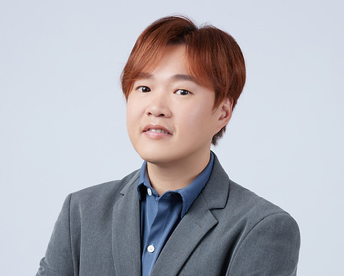

# Why Choose Benson - About Me

## Coach Profile

## About Me (關於我)

2004 年到澳洲讀大學，畢業後曾經在本地旅行社及銀行工作。2011 年通過畢業生計畫進入了澳洲公部門工作。

全職工作之餘，我希望透過中文教練服務幫助新澳洲人以及國際學生和背包客：認識自己、增加自信心、更清楚地表達自己、制定 SMART 的行動計劃，然後更快、更順利的在澳洲找到理想工作，並在澳洲職場走得更高、更遠！

## Rich Experience (豐富的經驗)

### 1. Corporate Career Coaching Experience
我曾在澳洲一個超過萬人的大型公司裡擔任全職的職涯教練，輔導過上百位員工分析自己的領導及管理能力，發現自身的優勢及成長機會，探索職涯可能性並制定個人化的行動計畫，以求在職涯上持續成長。

### 2. Recruitment and Hiring Perspective
我曾在同一間公司多次幫公司招募新血，看過上百封的申請及面試過上百位的求職者。我能提供用人單位的視角教你怎麼像招聘人員一樣思考，給出最讓人驚艷的申請及面試內容！

### 3. Graduate Program Coaching
我已經數年擔任某大型畢業生計畫的特約職涯教練，幫剛進公司的未來棟樑適應新職涯及工作，解決眼前的職涯挑戰，並制定個人化的行動計畫為畢業生計畫結束後的升遷做準備！

### 4. Personal Workplace Experience
除了以上經驗，我也是一名在澳洲職場工作了 15 年以上的員工，親身經歷過也看過許多人處理各種不同的職涯及職場挑戰例如：工作與生活平衡、人際關係、及文化適應。在適當的時候我可以分享我的經驗與觀察。

## Understanding Coach (懂你的教練)

你不但可以用國語或粵語舒服及準確地和我分享你的感受和想法，更重要的是，我了解華人社會及職場文化如何影響了你的思維及行為模式！同時，作為新澳洲人，我明白你在澳洲職涯與職場所經歷的痛點！

## Flexible Meeting Times (彈性的晤談時間)

Benson 知道大部分的客戶都有工作及其他家庭和個人的責任，因此我提供平日晚上、周末以及節假日的晤談時間以求提供最大的彈性，無額外收費！

## Service Philosophy (我的服務信念)

### 1. You Deserve an Amazing Second Life
你值得擁有精彩的第二人生。如果你的人生可以在澳洲重新開始，職涯也可以。我將引導你探索你在澳洲以及目前人生階段可能擁有的各種機會，不受限於你過去的工作經驗、教育或培訓。

### 2. You Have Autonomy
你擁有自主權。你應該過自己想要的生活，而不是社會或他人期望你過的生活。我會幫助你理解自己的渴望，並制定實現目標的行動計劃。我相信你最知道什麼最適合你。

### 3. All Experience is Valuable
任何經驗都是有價值的。我相信你在海外工作、志工和社區工作中培養的能力和技能都是寶貴且通用的。我將幫你讓澳洲的雇主清楚地認識到這些價值。

### 4. You Are Competitive
你具有競爭力。雖然英語是你的第二語言，但這代表你會多種語言！我會幫助你認識到自己擁有的優勢，而不是你缺乏的，並幫助你向潛在雇主展示這些優勢。

### 5. You Can Express Your Authentic Self
你可以表達最真實的自己。我們的晤談時間為你提供一個安全的空間，讓你測試想法，制定行動計劃，並在深入思考和討論後定案！我尊重你的經驗、想法和感受，並會以非批判的態度傾聽你。

---

*Source: https://www.bensonwong.com.au/whybenson*